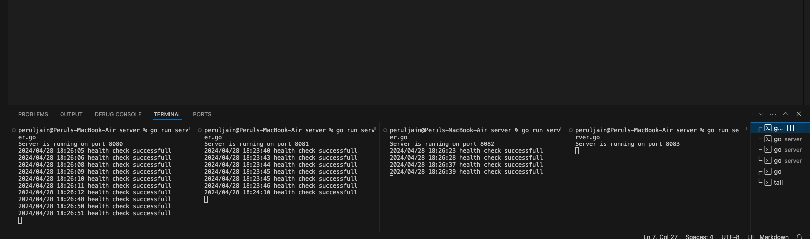

# Context
Build an load balancer poc using round robin algorithm

# Steps to run
1. Change port in server/server.go 
2. run command : go run server.go in 4 different terminals
3. go run load-balancer.go

